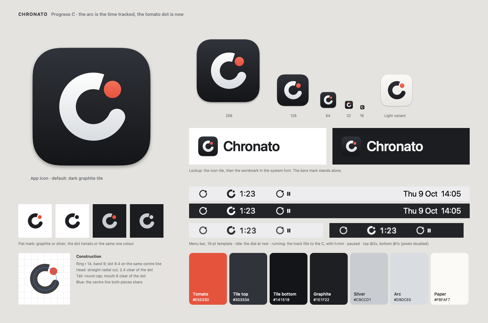

# Chronato brand

**Name:** Chronato. One word, capital C. Native UI labels use the system font.

## The mark: Progress C

One thick ring cut in two. The long **arc** is the time already tracked; the
**dot**, on the same circle just ahead of the arc's head, is *now*. Read as a
letter, the two pieces are a C. Read as an instrument, they are a progress
ring moving clockwise, with the present at its tip.

What makes it Chronato's own, and not just "a C with a dot":

- **The dot sits on the ring's path**, centred on the band's centre line and as wide as the band, where the next stretch of the ring would be. It is never inside the C and never in front of its mouth.
- **The cut**: the arc's head ends in a straight radial cut, a clock's tick, a narrow gap before the dot. The tail, where the time began, ends round.
- **The mouth** of the C is the wide gap between the dot and the tail.

Construction on a 64-unit grid, y up, angles counter-clockwise from 3 o'clock.
The master is `Ring` and `Mark.master` in `scripts/make-icon.swift`; the
generated `mark.svg` repeats the numbers in a comment.

| Part | Value |
|---|---|
| Ring | centre (33, 32), radius 14 to the band's centre line, band 9 |
| Dot | diameter 9.4 (4 % wider than the band, because a dot reads smaller than a line), on the centre line at 42° |
| Head | straight radial cut at 71.4°, 2.4 units clear of the dot |
| Tail | round cap centred at −23.8°, 6 units clear of the dot (the mouth) |
| Size | outer diameter 37 units, 58 % of the grid; the bounding box is centred |

At 16 px the icon uses an optical redraw (`Mark.small`): radius 15, band 10,
dot 11, a cut of 5 and a mouth of 8, so the cut stays a whole pixel.

## Colours

| Name | Hex | Use |
|---|---|---|
| Tomato | `#E5533D` | The dot, and only the dot. The app's one accent (`Studio.accentFill`) |
| Graphite tile | `#30333A` → `#141518` | The app icon's tile, top to bottom (the default) |
| Arc | `#FFFFFF` → `#D9DCE0` | The arc on the graphite tile: white into satin silver |
| Graphite | `#1E1F22` | The flat mark on light backgrounds |
| Silver | `#C9CCD1` | The flat mark on dark backgrounds |
| Paper | `#FBFAF7` → `#E9E7E2` | The light variant's tile; its arc is graphite `#2C2F35` → `#1C1E22` |

- **The app icon is the dark graphite tile** with the white arc and the tomato dot, on every platform and in both appearances. The light variant (paper tile, graphite arc) is for print and light documents; it is not shipped as an icon.
- **Tomato is the dot only.** Never the arc, the tile, a large fill or small text (3.7:1 on white, 4.4:1 on graphite).
- Gradients are a soft top light only: no bevel, no baked shadow. In the Icon Composer icon the fills are flat and the system adds glass, light and shadow.

## Usage

- **The mark alone**, or the **app icon with the wordmark** (beside it, or above it as in the README). Never the bare mark directly before the word "Chronato": it reads as "C Chronato". The lockup is the icon tile, then "Chronato" in SF Pro Semibold with slight negative tracking, the tile about twice the cap height.
- In a one-colour version (black, white, graphite or silver), arc and dot take the same colour (`mark.svg`, `currentColor`).
- Don't rotate, mirror, outline or stretch the mark, round the head's cut, move the dot off the ring, or put text inside it.
- Leave clear space of at least a quarter of the mark's height on all sides.
- The smallest sizes are 16 px for the app icon and the dedicated 18 pt glyph in the menu bar.

## Menu-bar glyph

`Brand.menuBarGlyph(running:)` in `Sources/Chronato/Brand.swift`: an 18 pt
template image, an optical redraw rather than a scaled copy, never tinted.
Ring centre (9, 9), radius 5.5 to the centre line, dot 3.4 at 42°.

- **Idle: the dial at rest.** A thin closed track (band 1.5 pt) with the dot set into it: the gaps either side of the dot are 0.4 pt hairlines that close up at 1x. No open end, so it reads as still, not as a spinner or a refresh arrow.
- **Running: the track fills to the C.** Band 3 pt, the cut (1.2 pt) and the mouth (2.2 pt) open, next to the `h:mm` title. Shape and weight both change, so the state reads at a glance without colour, at 1x and 2x.
- **Paused:** the idle glyph and a 7 pt `pause.fill` badge (`MenuBarController`).

## Files

- `mark.svg`: the flat mark in one colour (`currentColor`).
- `logo.svg`: the two-colour flat mark for web pages, on its own. Arc graphite in light mode, silver in dark mode; the dot tomato.
- `Chronato.icon`: the Icon Composer document, the app icon of both apps. `icon.json` holds the graphite gradient fill and two glass layers, `Assets/arc.svg` and `Assets/dot.svg`, so the glass treats "now" as its own piece. On the Mac, `scripts/build-app.sh` compiles it with `actool` into `Contents/Resources/Assets.car` (`CFBundleIconName` Chronato). The iPhone project references this same file; Xcode compiles it into the app's `Assets.car`, layered for iOS 26 and later and flattened for iOS 18 to 25 and the App Store.
- `AppIcon.icns`: every macOS size, the fallback (`CFBundleIconFile`).
- `logo-1024.png`: the macOS icon at 1024 px, for presentations and the README, where it stands above the name.
- `AppIcon-iOS-1024.png`: the iPhone icon drawn flat, full bleed and without alpha. Its 264 px copy is the iPhone's `Brandmark.imageset/Brandmark.png` (`sips -Z 264`), the large mark in onboarding and About.
- `brand-board.png`: this page's board.

`swift scripts/make-icon.swift Branding` writes all of them except
`Chronato.icon/icon.json`, which is edited by hand or in Icon Composer.
The apps draw the same mark from `MarkRing` in `Sources/ChronatoCore/Mark.swift`:
the Mac's Settings → About and menu-bar glyph (`Brand.swift`), and the iPhone's
Dynamic Island (`iOS/Shared/Brand.swift`, `Mark`). Change the script and
`Mark.swift` together.
