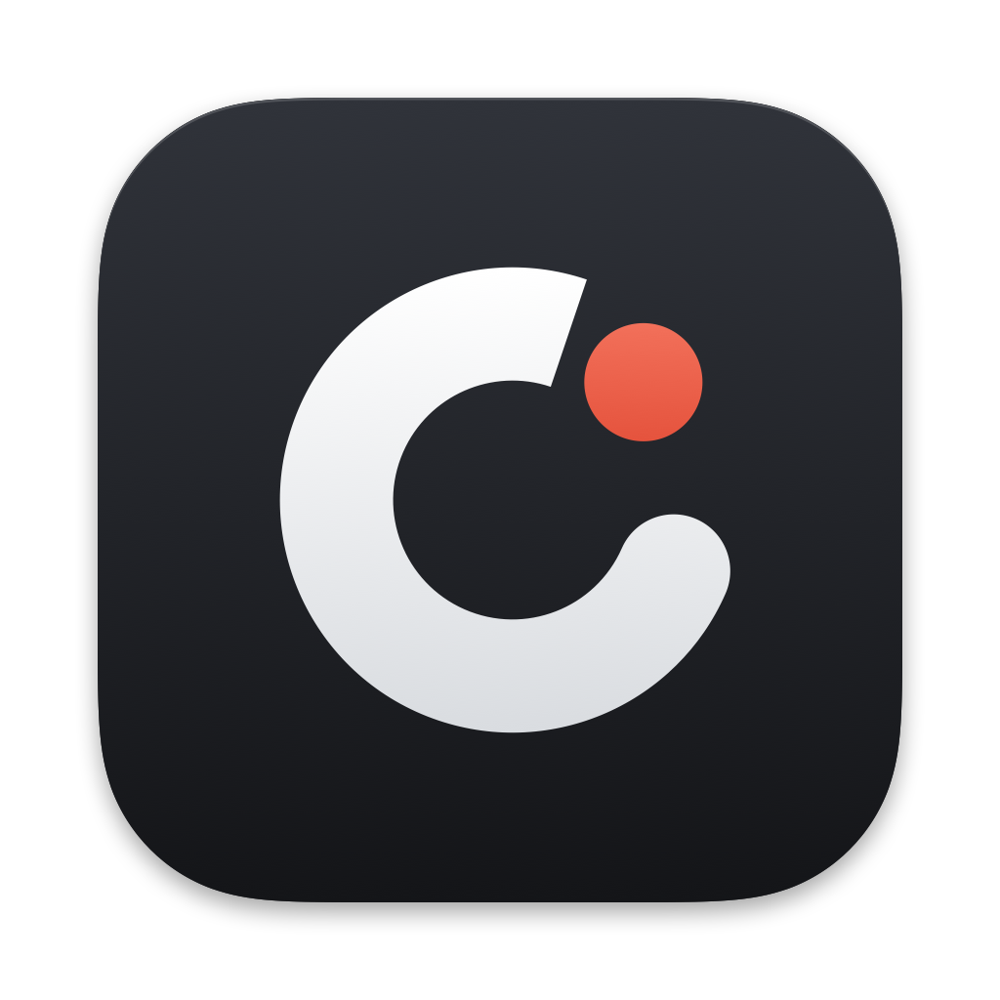

<p align="center">
  
</p>

<h1 align="center">Chronato</h1>

<p align="center">Native <a href="https://www.kimai.org">Kimai 2</a> time tracking for the Mac menu bar and the iPhone.</p>

## Features

**Mac (menu bar)**

- **Start, pause, stop** from a native menu-bar menu: **Start ▸** customer ▸ project ▸ activity, or **New Timer…** (⌘N) to search every combination and add a note up front. Pause ⌘P, Stop ⌘S, Add Note… ⌘E.
- **Live time in the menu bar**, optionally with the customer name.
- **Recent activities**: start an earlier customer/project/activity/note again with one click.
- **Server sync**: a timer started in the Kimai web UI, on the iPhone or on another Mac shows up in Chronato, and the other way round.
- **Idle auto-pause**: after a set time without keyboard or mouse input (default 10 minutes) the timer stops at the moment you left. When you come back, choose to resume, count the away time (more than 4 h only after a confirmation), stay paused, or stop. Sleep is handled the same way, and so is the time Chronato was not running: quitting with a running timer asks first.
- **24 h auto-stop**: any timer, yours or an AI agent's, that runs for 24 hours is stopped at the last activity.
- **Global shortcut ⌃⌥⌘T**: pause or resume, or start the most recent activity.
- **Reports**: your hours per customer, then project and activity, by day, week, month or year, split into Me / AI.
- **AI agents via MCP**: coding agents on an allowlist book their own time, each with its own token, as a separate Kimai user tagged `ai-<agent>`.
- **Launch at login**, **automatic updates** (Sparkle, EdDSA-signed) and a **Light / Dark / Match System** appearance.

**iPhone** (source in [iOS/](iOS/README.md), currently in TestFlight)

- The same tracking, recent entries and reports.
- **Live Activity** on the Lock Screen and in the Dynamic Island, with Pause and Stop.
- **Widgets** for the Home Screen and Lock Screen, with interactive buttons.
- **Shortcuts and Siri**: start, pause, resume, stop, "what am I tracking?"; works with the Action button.

Kimai has no paused state. Pause stops the entry; Resume starts a new one with the same project, activity, note and tags.

## Install (Mac)

Requires a Mac with Apple silicon, macOS 26 or later, and a Kimai 2 server with API access over HTTPS.

Download `Chronato-<version>.dmg` from [Releases](https://github.com/weidhaus/Chronato/releases) and drag Chronato to Applications. Releases are signed with a Developer ID and notarized by Apple, and Chronato keeps itself up to date.

## Setup

1. In Kimai, open your profile → **API Access** and create an API token.
2. In Chronato, open **Settings → Connection** and enter the server URL (for example `https://kimai.example.net`) and the token.

## AI agents

Chronato includes an MCP server (`Chronato mcp`). Agents such as Claude Code, Codex or Cursor use it to track the time they work. Only agents you allow in **Settings → AI Agents** can book time, and each has its own token. Their time is booked as finished entries for a separate Kimai user, so your own timer is never stopped. Setup and tools: [docs/AI-AGENTS.md](docs/AI-AGENTS.md).

## Privacy

- The server URL and API token are stored in the Keychain. Kimai traffic is never cached to disk.
- Chronato talks only to your Kimai server, plus GitHub to check for app updates.
- AI-agent tokens are kept only as SHA-256 hashes in `~/Library/Application Support/Chronato/agents.json`.

## Development

Building the app needs Xcode 26 or later (the SwiftUI macros ship with Xcode, not with the Command Line Tools).

```sh
swift build
swift test                                      # ChronatoCore unit tests (stubbed URLSession, temp dirs)
scripts/e2e.sh                                  # the real engine against a local mock Kimai (scripts/mock-kimai.py)
swift run Chronato snapshot /tmp/chronato-ui    # every Mac UI surface as PNGs (light and dark) and the menu per state as text, fixture data
scripts/build-app.sh                            # signed Apple-silicon app in dist/Chronato.app
swift scripts/make-icon.swift Branding          # redraw the icons, SVGs and brand board (Branding/brand.md)
```

- `Sources/ChronatoCore`: Kimai client, models, report maths, AI-agent sessions and the MCP server. Shared with the iPhone app.
- `Sources/Chronato`: the Mac menu-bar app.
- `iOS/`: the iPhone app, widgets, Live Activity and App Intents ([iOS/README.md](iOS/README.md)).

The one read-only test against a real Kimai runs only when both `CHRONATO_LIVE_URL` and `CHRONATO_LIVE_TOKEN` are set.

### Releasing

- Mac: `scripts/release.sh <version>` builds, signs, notarizes and staples the disk image, signs the Sparkle appcast and publishes a GitHub release. `--dry-run` stops before notarization.
- iPhone: `scripts/ios-release.sh` archives and uploads to App Store Connect / TestFlight with an App Store Connect API key (`ASC_KEY_PATH`, `ASC_KEY_ID`, `ASC_ISSUER_ID`). `--dry-run` validates without signing.

## Licence

MIT, see [LICENSE](LICENSE). Brand assets and rules are in [Branding/](Branding/brand.md).

Chronato is an independent project. It is not affiliated with or endorsed by Kimai.
